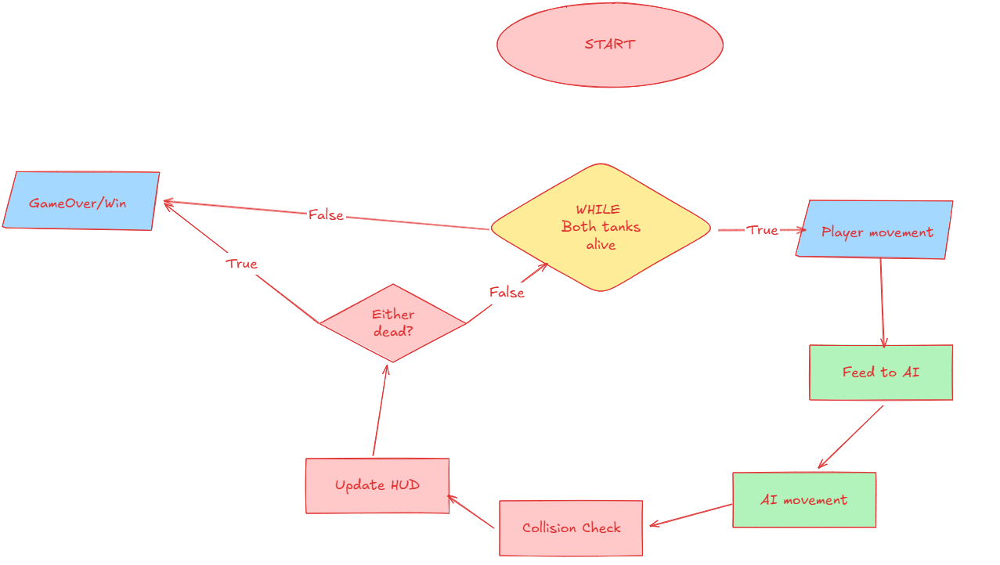
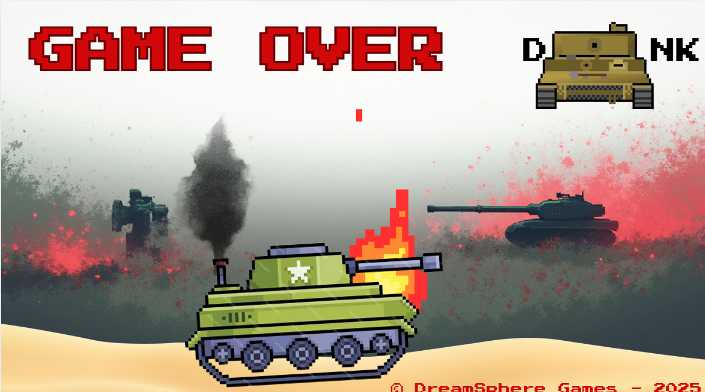
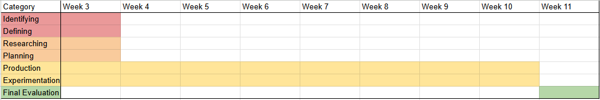

# d o n k
This is the official markdown for Siddhant Bhale's 9CT1B Assessment Task 3 Part B

## Identifying & Defining

## Identifying a Need

As AI becomes more and more prevalent in our society, it is important to understand its adaptability and speed of behavioural change, as it will assist the common people in better understanding, and thus utilising these systems for their intended use as opposed to a glorified search engine. This game aims to prove the rapid pace of AI's adaptability.

## Requirements Outline

### Inputs
|Input|Method|Effect|
|-----|------|------|
|W|Input.GetKeyDown(KeyCode.W)|Move the player tank forward|
|A|Input.GetKeyDown(KeyCode.A)|Turn the player tank left|
|S|Input.GetKeyDown(KeyCode.S)|Move the player tank backward|
|D|Input.GetKeyDown(KeyCode.D)|Turn the player tank right|
|R|Input.GetKeyDown(KeyCode.R)|Reload the player tank|
|Left Click|Input.GetMouseButton(0)|Shoot the player tank|
|Right Click|Input.GetMouseButtonDown(1)|Zoom in the player cam|
|Mouse X Movement|Input.GetAxis("Mouse X")|Change camera direction and aim turret|
|Mouse Y Movement|Input.GetAxis("Mouse Y")|Change camera direction and aim turret|

### Processing
The game must accurately process these inputs to provide a seamless UX and respond quickly, not feeling sluggish or sensitive.

### Outputs
The game will output visual and auditory signals and on the correct key press conduct the associated action which should be displayed to the player.

### Transmission
The transmission of in-game telemetry will be requried internally.

### Storage
Data including; Current level, ML skill level, loadouts, vehicles and player data will need to be stored and will be stored through metadata.

## Functional and Non-Functional Requirements:

### Functional Requriements:

<ul>
  <li>Allow the player to control a tank (movement, aiming, firing, defense).</li>
  <li>Include a user interface for health, ammo, and status indicators.</li>
  <li>Implement an opposing tank controlled by a machine learning model.</li>
  <li>The AI should learn and adapt to the player’s behavior over time.</li>
  <li>Detect collisions between tank projectiles and tanks.</li>
  <li>Track damage to both player and enemy tanks.</li>
  <li>Adjust AI difficulty dynamically based on the player’s style.</li>
  <li>End the game when either the player or AI tank is destroyed.</li>
  <li>Record player actions (movement, shots fired, evasion patterns) to feed the AI learning.</li>
  <li>Optionally allow saving the player’s progress or AI learning state.</li>
</ul>

### Non-Functional Requirements

<ul>
  <li>Smooth real-time gameplay at at least 60 FPS.</li>
  <li>AI learning calculations must not cause noticeable lag.</li>
  <li>Game should not crash during tank interactions or AI computations.</li>
  <li>AI must consistently update based on player actions without corruption.</li>
  <li>AI should handle different player strategies efficiently.</li>
  <li>Tank mechanics should support expansions (e.g., more weapons or arenas).</li>
  <li>Controls must be intuitive and responsive.</li>
  <li>Clear visual/audio feedback for player actions and AI responses.</li>
  <li>Modular code structure to allow updates to AI learning algorithms.</li>
  <li>Easy addition of new tank types or environments.</li>
  <li>Prevent external manipulation of AI learning data if saving/loading is implemented.</li>
</ul>

## Social & Ethical Issues
### Social Issues and Impacts

1. **Addictive Gameplay**
   - **Issue:** The adaptive AI could continuously challenge the player, increasing playtime and making it difficult to disengage.  
   - **Impact:** Users may spend excessive time playing, which could affect health, sleep, or social interactions. Society may see increased concern over video game addiction in players.  

2. **Stress and Frustration**
   - **Issue:** The AI learning to counter the player’s style could create high difficulty early in gameplay.  
   - **Impact:** Some users may feel frustrated or discouraged, potentially reducing enjoyment or causing negative emotional responses. This could influence attitudes toward AI-driven games in general.  

3. **Accessibility**
   - **Issue:** Players with slower reflexes or certain disabilities may struggle more than others.  
   - **Impact:** This could create exclusionary experiences, limiting who can fully enjoy the game and raising questions about inclusivity in adaptive AI games.  

### Ethical Issues and Impacts

1. **Data Privacy**
   - **Issue:** The game collects detailed behavioral data to train the AI.  
   - **Impact:** If data is stored improperly or shared, it could compromise user privacy. Society may respond with skepticism about games using AI that tracks behavior.  

2. **Algorithmic Bias**
   - **Issue:** The AI might exploit predictable player weaknesses in ways that feel unfair or frustrating.  
   - **Impact:** This could erode trust in AI systems in games, fostering a perception that adaptive AI is “too powerful” or manipulative.  

3. **Transparency**
   - **Issue:** If the game doesn’t clearly inform players that the AI is learning, it may be perceived as deceptive.  
   - **Impact:** Ethical concerns could arise over consent, as users may not realize their gameplay is being analyzed and adapted to.  

4. **Potential Misuse**
   - **Issue:** Techniques used for the adaptive AI could be adapted for surveillance or manipulative technology outside gaming.  
   - **Impact:** Raises broader societal concerns about AI ethics, data use, and the implications of training AI on human behavior.  

### Overall Impact

- **On Users:** Could enhance engagement and skill development, but also risk frustration, stress, and privacy concerns.  
- **On Society:** Promotes discussion about ethical AI in entertainment, the importance of transparency, and the balance between challenge and fairness in adaptive systems.

## Researching & Planning

## Eval of Existing Ideas

| Game                | Plus (+)                                                                 | Minus (−)                                                                 | Implication (I)                                                                 |
|--------------------|---------------------------------------------------------------------------|---------------------------------------------------------------------------|--------------------------------------------------------------------------------|
| **World of Tanks**  | - Realistic tank combat mechanics                                         | - AI is predictable and not fully adaptive                                  | - Players may develop repetitive strategies and AI becomes easy to exploit     |
|                    | - Variety of tanks and customization                                       | - Singleplayer AI lacks challenge after repeated play                        | - Limits replayability in singleplayer mode                                     |
|                    | - Singleplayer missions allow tactical experimentation                    | - AI learning is minimal                                                  | - Game focuses more on multiplayer than evolving AI behavior                   |
| **War Thunder**    | - Highly detailed physics and realistic tank simulation                    | - AI often follows scripted patterns, limited adaptability                   | - Players may rely on exploiting AI patterns instead of improving strategy     |
|                    | - Combines air, land, and naval combat, providing varied scenarios        | - Singleplayer missions can be inconsistent in difficulty                    | - Encourages trial-and-error learning rather than adaptive learning             |
|                    | - Some AI attempts to simulate realistic enemy tactics                     | - AI does not learn from player-specific behaviors                           | - Adaptive gameplay like *d o n k*’s concept is largely absent                 |
| **Armored Warfare** | - PvE missions have AI that responds to team positioning and strategy     | - AI adaptation is limited and only scenario-specific                        | - Encourages players to adjust tactics within missions but not across sessions |
|                    | - Focus on strategy and positioning                                        | - Less AI variety compared to WoT                                           | - Limits long-term replayability and challenge in singleplayer                  |
|                    | - Mix of singleplayer and cooperative missions                              | - Microtransactions can affect progression                                    | - Players may feel progression is unbalanced, reducing satisfaction             |

## Flowcharts & Pseudocode

### Pseudocode

    START GAME
    INITIALIZE player tank
    INITIALIZE AI tank
    INITIALIZE game environment
    SET playerScore = 0
    SET aiScore = 0

    WHILE playerTank.isAlive AND aiTank.isAlive DO
        DISPLAY game environment
        GET playerInput
        UPDATE playerTank position and actions based on input

        RECORD player actions for AI learning
        UPDATE aiTank strategy using ML model based on recorded player actions
        EXECUTE aiTank movement and firing

        CHECK collisions between projectiles and tanks
        APPLY damage to tanks as appropriate
        UPDATE game HUD (health, ammo, score)

        IF playerTank.isDestroyed OR aiTank.isDestroyed THEN
            DISPLAY winner
            OFFER restart option
    END WHILE

    END GAME

### Flowchart

## Storyboards

### Game Start Scene

### Game Over Scene

## Time and Action Plan

### Gantt Chart

